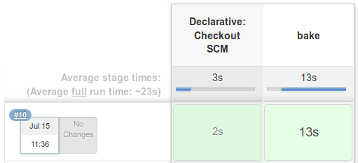
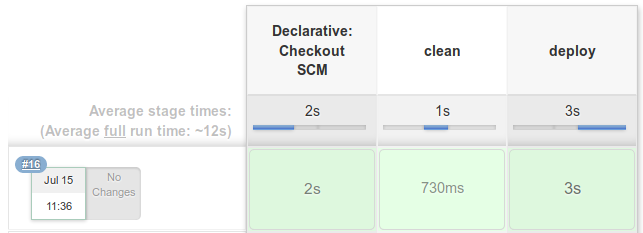

# Jenkins

It demonstrates how to use Jenkins Pipelines. There are two pipelines: `bake` and `deploy`.

The `bake` pipeline compiles the Go application into an executable and uses Packer to build a Docker image to run it.

The `deploy` pipeline runs the container built by Packer and exposes the application on port 8080.

Both pipelines can be run independently.

## How to setup

The SSH key to GitHub need to be set on [Credentials page](http://localhost:9091/credentials/store/system/domain/_/newCredentials).

To setup the pipeline, follow the steps below.

1. Create a new item
2. Enter GitHub URL, branch (e.g: `jenkins`) and Jenkinsfile path (e.g: `jenkins/{bake,deploy}.Jenkinsfile`)

### Preview

| Pipeline | Preview |
| :--- | :--- |
| Bake |  |
| Launch |  |

### How to test

| Feature | Command |
| :--- | :--- |
| Execute an operation | `curl http://localhost:8080/calc/sum/2/3` |
| See operations done in the past | `curl http://localhost:8080/calc/history` |
